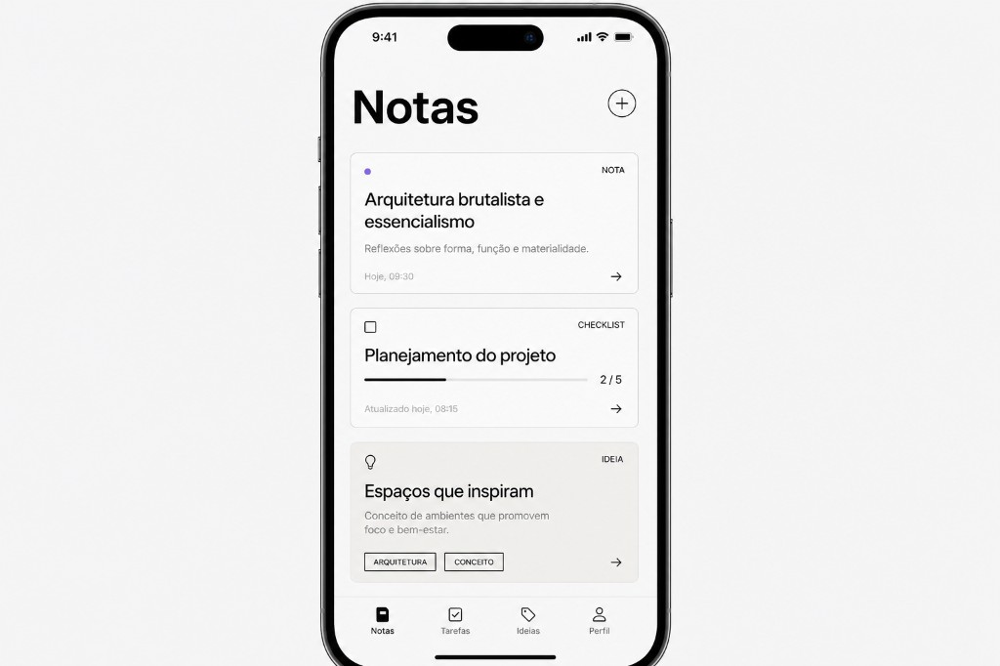

# Dirección de diseño UI — NoteFlow

**Decisión (Sandra):** seguimos el camino del mockup de referencia — **minimalista, alto contraste, tipografía bold, tarjetas con borde fino** — con una capa extra de **grises** para jerarquía y calma visual (menos “blanco puro vs negro puro”).

## Personalidad

| Atributo | Cómo se traduce |
|----------|------------------|
| **Pro** | Espaciado generoso, labels discretos, sin adornos innecesarios |
| **Moderno** | Sans-serif contundente, cards tipo “panel”, flecha de detalle consistente |
| **Urban / editorial** | Monocromo dominante + **un solo acento** (punto violeta en notas); tags y barras en escala de grises |
| **Más grises** (ajuste acordado) | Fondos, bordes, previews, tracks y metadatos en **varios tonos de gris**, no solo negro/blanco |

No usamos por ahora la dirección “nocturno violeta full dark” ni gradientes llamativos. El **modo oscuro** será la misma lógica invertida (grises profundos + texto claro), no un tema distinto.

## Escala de grises (objetivo)

Usar estos valores como tokens en `constants/theme.ts` cuando se implemente la UI (nombres orientativos):

| Token | Hex (claro) | Uso |
|-------|-------------|-----|
| `background` | `#F2F2F5` | Fondo de pantalla (gris muy claro, no blanco `#FFF`) |
| `surface` | `#FFFFFF` | Fondo de tarjeta |
| `surfaceMuted` | `#F7F7F9` | Variante suave (cabeceras, inputs) |
| `border` | `#E4E4E8` | Borde 1px de tarjetas |
| `borderStrong` | `#C8C8CE` | Separadores más visibles |
| `textPrimary` | `#141414` | Títulos |
| `textSecondary` | `#5C5C63` | Preview, cuerpo secundario |
| `textTertiary` | `#8A8A92` | Labels `NOTA` / `CHECKLIST` / `IDEIA`, timestamps |
| `textDisabled` | `#B0B0B8` | Placeholders, estados vacíos |
| `track` | `#E0E0E6` | Fondo barra de progreso (checklist) |
| `fill` | `#1A1A1E` | Relleno barra de progreso |

**Acento de marca (puntual):** violeta `#5B458C` — solo donde aporte significado (p. ej. indicador de tipo Nota), no en toda la UI.

## Estructura de pantalla (lista)

- **Cabecera:** título grande (“Notas”, “Checklists”, “Ideas”) + botón circular **+** con borde gris (`borderStrong`), no FAB flotante morado (salvo que se decida mantener FAB en implementación; prioridad visual = mockup).
- **Lista:** `FlashList` sobre fondo `background`; tarjetas con `surface`, borde `border`, radio ~12–16, padding 16.
- **Pestañas inferiores:** iconos línea; activo en `textPrimary`, inactivo en `textTertiary`.

## Las tres tarjetas

### NoteCard

- Label superior derecha: `NOTA` en caps, `textTertiary`.
- Indicador superior izquierda: **punto violeta** (único acento fuerte).
- Título `textPrimary`, bold.
- Preview una línea `textSecondary`.
- Pie: timestamp `textTertiary` + chevron/flecha `textDisabled`.

### ChecklistCard

- Label `CHECKLIST`; icono checkbox outline en gris medio.
- Título bold.
- Barra: track `track`, fill `fill` (casi negro).
- Fracción `2 / 5` en `textSecondary`, cifras tabulares si es posible.
- Pie: “Atualizado…” / fecha en `textTertiary`.

### IdeaCard

- Label `IDEIA`; icono bombilla outline gris.
- Título + preview en grises (como nota).
- **Tags:** rectángulos con borde `borderStrong`, texto caps `textSecondary`, fondo `surfaceMuted` (sin colores chillones por defecto).
- Opcional futuro: tinte de fondo muy suave por `idea.color` (gris cálido o frío), sin saturación alta.

## Formularios y detalle (alineación)

- Misma escala de grises en inputs outlined, errores Zod en `error` del tema.
- Modal `nueva-note`: fondo `background`, campos sobre `surface`.
- Detalle `[id]`: mismos tokens; acciones destructivas con confirmación, sin botones rojos gigantes.

## Mapeo producto ↔ UI

| Pestaña app | Label en tarjeta | Tipo en `types/` |
|-------------|------------------|------------------|
| Notas | NOTA | `Note` |
| Checklists | CHECKLIST | `ChecklistNote` |
| Ideas | IDEIA | `IdeaNote` |

## Qué evitar

- Gradientes morado–rosa, neones, sombras pesadas.
- Demasiado blanco puro (`#FFFFFF`) como fondo de **pantalla** (reservar blanco para **tarjetas**).
- Colores distintos por pestaña en tab bar (mantener monocromo + acento mínimo).

## Referencias descartadas para v1

- Mockups “nocturno editorial” full dark como tema principal (queda como variante oscuro derivada de esta base).
- Estilo “concrete brutal” sin grises intermedios (sustituido por esta decisión con **más grises**).

## Implementación

**Estado:** tokens en `constants/theme.ts`, hook `useNoteFlowColors`, tarjetas en `components/items/` y listas con FlashList en `app/(tabs)/*/index.tsx`. Cabecera con botón **+** circular según mockup (sin FAB flotante violeta).

Al ampliar formularios o detalle, **esta doc y el PNG de referencia** siguen siendo la fuente de verdad visual hasta nuevo aviso de Sandra.
